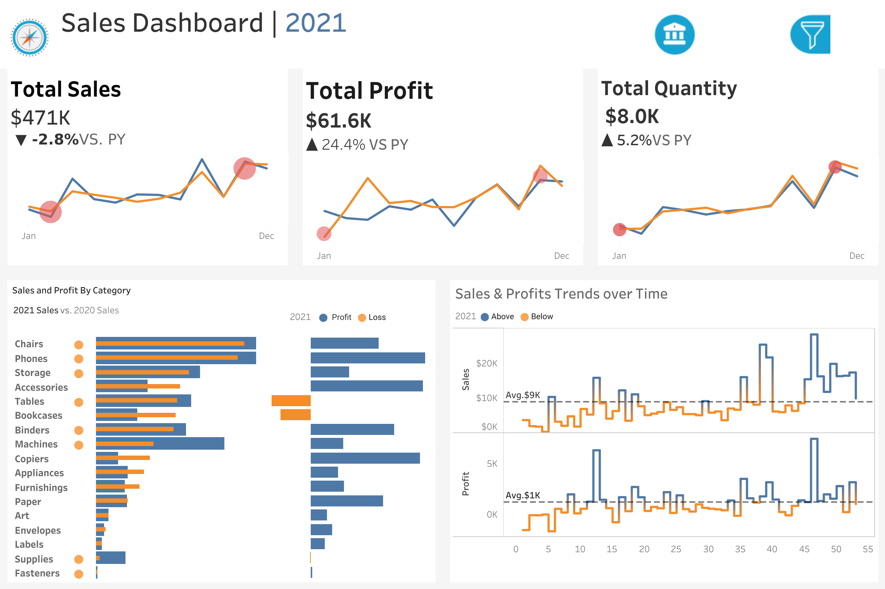

# 📊 Sales Dashboard - Tableau

## Overview
An interactive sales dashboard built with Tableau analyzing 2021 sales performance,
profit trends, and category-level insights compared to the previous year.

## 🔗 Live Dashboard
👉 [View Interactive Dashboard](https://public.tableau.com/views/Project1_17772190652080/SalesDashboard)

## 📸 Preview

## 🛠 Tools Used
- Tableau Public
- Data Visualization
- Sales Analytics

## 📁 Files
| File | Description |
|------|-------------|
| [`sales-dashboard.twbx`](sales-dashboard.twbx) | Tableau workbook file |
| [`sales-dashboard.png`](sales-dashboard.png) | Dashboard screenshot |

## 💡 Key Insights

- 📉 **Sales dipped slightly** — Total sales hit $471K in 2021, down 2.8% vs prior year,
  signaling a need to investigate demand or pricing strategies
- 📈 **Profit surged despite lower sales** — Total profit grew 24.4% YoY to $61.6K,
  indicating improved margins and cost efficiency
- 📦 **Volume up** — Total quantity sold increased 5.2% to 8K units,
  showing strong customer demand even as revenue dipped
- 🪑 **Chairs & Phones top revenue categories** — Consistently highest sales across 2021,
  making them core revenue drivers
- 🔴 **Tables & Bookcases running at a loss** — Both categories show negative profit,
  flagging them as candidates for repricing or discontinuation
- 📊 **Sales volatile but trending up late year** — Spikes seen around weeks 45–50,
  suggesting strong Q4 seasonality worth capitalizing on
- ⚡ **Average weekly sales $9K, profit $1K** — Weeks above average cluster in Q3/Q4,
  pointing to second-half seasonal strength
